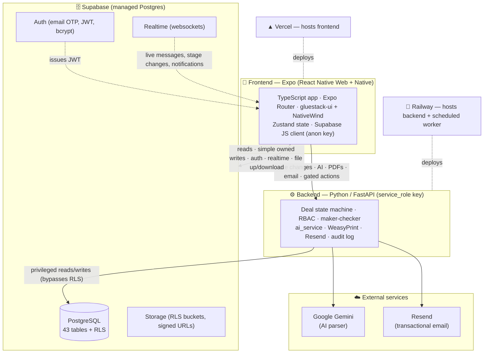
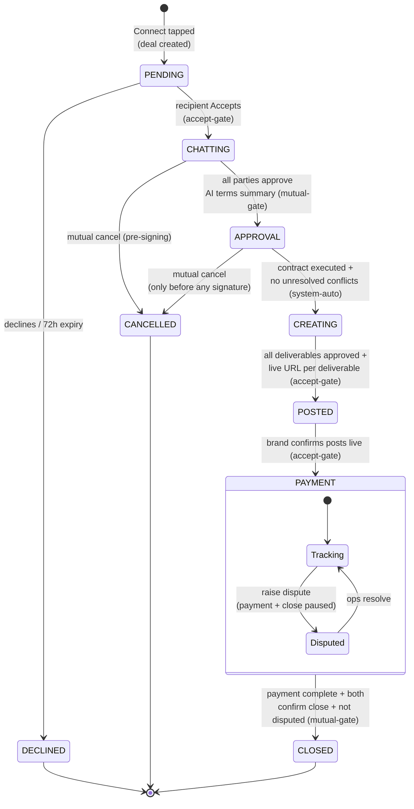
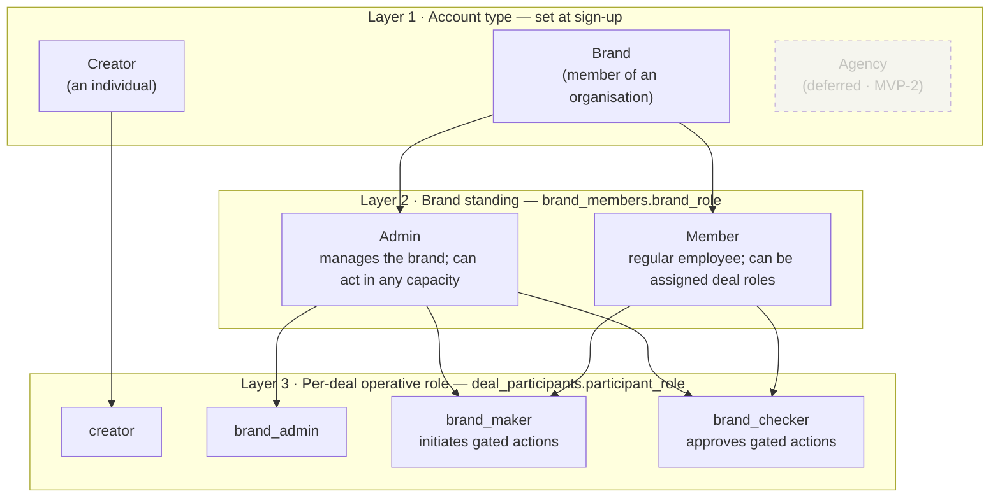
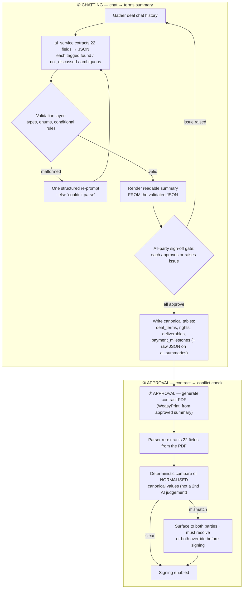
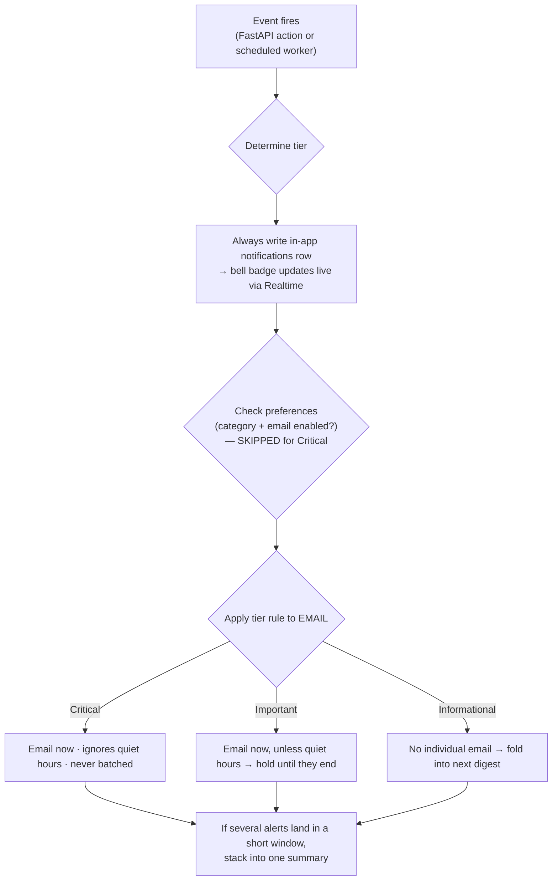

# Biz — MVP Technical Specification

| | |
|---|---|
| **Product** | Biz — a B2B deal operating system for the creator economy in India |
| **Document** | MVP Technical Specification |
| **Version** | v1.0 |
| **Date** | 2026-06-06 |
| **Status** | **Locked** — consolidated from the ten Phase-3 design docs |
| **Audience** | Engineering (and Claude Code) building the MVP |

> This document **consolidates** ten locked design docs into one buildable specification. It is the
> single source of truth for the MVP build. The underlying decisions — the stack, the 7-stage deal
> engine, the 43-table data model, the role model, and the MVP scope — are **locked**; this spec
> presents them as one coherent reference. Where the source docs flag an item as needing a decision
> before production, it is carried into **§13 Open decisions** rather than silently resolved.
>
> "Biz" is a working name and is kept as **Biz** throughout.

---

## 2. Table of contents

1. Title & metadata *(above)*
2. Table of contents
3. [Introduction](#3-introduction)
4. [Goals & non-goals](#4-goals--non-goals)
5. [System architecture](#5-system-architecture)
6. [Data model](#6-data-model)
7. [The deal engine (the core product)](#7-the-deal-engine-the-core-product)
8. [Roles & permissions (RBAC)](#8-roles--permissions-rbac)
9. [API architecture](#9-api-architecture)
10. [AI contract parser](#10-ai-contract-parser)
11. [Notifications](#11-notifications)
12. [Security](#12-security)
13. [Open decisions](#13-open-decisions)
14. [Deferred scope](#14-deferred-scope)
15. [Appendices](#15-appendices)
    - A. [Full 93-feature inventory](#appendix-a--full-93-feature-inventory)
    - B. [Glossary](#appendix-b--glossary)
    - C. [Source documents](#appendix-c--source-documents)

---

## 3. Introduction

### 3.1 Purpose of this document

This is the canonical MVP Technical Specification for **Biz**. It exists so that one engineer (or
Claude Code) can build the entire MVP from a single navigable document, without having to reconcile
ten separate design docs in their head. It resolves overlaps between those docs, keeps one
consistent voice, and cross-references rather than repeats. It is documentation, not application
code — the blueprint the build (Phase 5+) follows.

### 3.2 What Biz is

**Biz is a B2B deal operating system for the creator economy in India.** It connects **Creators**
and **Brands** and manages the full lifecycle of a brand–creator deal: discovery, negotiation, an
AI-generated contract with e-signature, content creation, posting, payment tracking, and close.

The marketplace is the front door, but it is not the product. The product is the structured
**7-stage deal flow** that replaces the chaos of WhatsApp threads and scattered spreadsheets with
one auditable, gated process. Around that flow sit four auto-populated **trackers** (deal, payment,
calendar, rights), an **AI contract parser** that turns a messy negotiation into 22 clean
structured fields, **notifications** (in-app + email), and a **security / RBAC / audit** layer
underneath everything.

### 3.3 What this spec covers and how to read it

**The MVP in one line:** *one Creator and one Brand, doing a deal properly, end to end.* The
marketplace is a convincing placeholder on mock data; the deal flow is real and complete.

The spec is organised outside-in. §4 fixes the scope boundary. §5 gives the system architecture and
locked stack. §6–§12 are the seven design domains — data model, deal engine, RBAC, API routing, AI
parser, notifications, security — each opening with a diagram and the key rules, then the detail.
§13–§14 collect what is deliberately unresolved or deferred. §15 holds the full feature inventory, a
glossary, and source references.

Throughout, **diagrams are Mermaid code blocks** so they are git-diffable and machine-readable. If a
section and a diagram ever disagree, the prose is authoritative and the mismatch is a bug to fix.

---

## 4. Goals & non-goals

### 4.1 What the MVP is (the goal)

Build the complete deal lifecycle for **one creator and one brand**:

> Onboarding (email OTP, mock social links, digital signature) → mock Discover → connect → chat →
> AI terms summary → platform-generated contract + e-sign → content / revisions → posting proof
> (hard gate) → payment tracking → close and ratings — with the deal, payment, calendar, and
> rights/exclusivity **trackers** auto-populated from the AI contract parser, **notifications**
> (in-app + email), and **security / RBAC / audit** underneath everything.

Concretely the MVP is **93 features across 7 buckets** (full list in [Appendix A](#appendix-a--full-93-feature-inventory)):

| Bucket | Build phase | Features |
|---|---|---|
| 1 — Identity & Trust | Phase 7 | 18 |
| 2 — Discovery (placeholder / mock) | Phase 8 | 13 |
| 3 — Deal Engine | Phase 9 | 32 |
| 4 — AI Contract Parser | Phase 10 | 5 |
| 5 — Tracking | Phase 11 | 15 |
| Cross-cutting — Security | Phase 12 (throughout) | 6 |
| Cross-cutting — Notifications | Phase 12 (throughout) | 4 |
| **Total** | | **93** |

### 4.2 What the MVP is not (non-goals)

The MVP deliberately stops at *tracking and structuring* the deal. It does **not** move money, pull
live social data, or run a real marketplace. Specifically out of scope for the build:

- **No real payment processing.** Payment is tracking-only — states, milestones, and reminders; no
  gateway, escrow, or auto-release.
- **No live social APIs.** Follower counts, engagement, and reach are **mock** values. No OAuth.
- **No real marketplace.** Discovery is mock browse + profile view + one basic Connect that seeds a
  deal. No Campaigns, Products, or Experiences & Events flows.
- **No SMS / 2FA / push.** Auth is email + password with email OTP; notifications are in-app +
  email only.
- **No brand-uploaded contracts, no Tax Tool, no Document Hub, no Agency user type.**

### 4.3 The four scope tiers at a glance

Scope is governed by four tiers. Only **Tier 1** is built now. Lower tiers are summarised here and
detailed in [§14 Deferred scope](#14-deferred-scope).

| Tier | Name | Meaning |
|---|---|---|
| **1** | **Build MVP** | The 93 features above. Built now (Phases 5–14). |
| **2** | MVP-2 | v5-tagged "MVP" features deliberately deferred from the first build (real payments, marketplace, brand-uploaded contracts, Tax Tool, Document Hub, SMS/2FA, etc.). Build after the core flow is validated. |
| **3** | MVP-3 | v5-tagged "MVP2" / post-launch features (AI-ranked discovery, escrow + auto-release, integrations, Hindi/regional language). |
| **4** | Future | Long-term vision, no timeline (Agency & Partner user types, new deal types, multi-market compliance). |

> **Scope-violation rule (locked):** if any build task references a Tier 2–4 feature during the MVP
> build, **stop and flag it** in `docs/progress.md` — do not silently expand scope. The IN/OUT
> boundary lives in `docs/scope.md`.

---

## 5. System architecture

### 5.1 High-level architecture

Biz is a single Expo app (running as web for MVP, native later) talking to two backends: **Supabase
directly** for the bulk of reads, auth, realtime, and storage; and a **Python/FastAPI** service for
everything that changes deal state, uses AI, generates a document, sends email, or needs elevated
privileges. Both talk to the same Postgres database; they differ only in *who enforces the rules*
(see [§9](#9-api-architecture)).



**Frontend (Expo).** One TypeScript codebase runs as a web app today and compiles to iOS/Android
later without a rewrite. It talks to Supabase directly with the **anon key** for auth, simple reads,
realtime subscriptions, and file storage — all protected at the database level by RLS.

**Backend (FastAPI).** Uses the elevated **service_role key** to perform privileged operations:
deal-stage transitions, contract generation, RBAC enforcement, AI calls, email. This key never
touches the frontend.

**Data & infra (Supabase).** One managed product gives Postgres, Auth, Realtime, Storage, and Row
Level Security — replacing four separate services. Frontend on **Vercel**, backend on **Railway**,
both deploying from a private GitHub **monorepo** on push.

### 5.2 The locked stack (with one-line reasoning)

| Layer | Choice | Why (one line) |
|---|---|---|
| Frontend framework | **Expo (React Native + RN Web)** | One codebase → web now, native later, no rewrite. |
| Frontend language | **TypeScript, strict mode** | Catches type errors before runtime; Claude Code writes safer code. |
| Navigation | **Expo Router** | File-based routing; one mental model across web + native. |
| UI library | **gluestack-ui v3 + NativeWind** | Cross-platform components (web + iOS + Android) + Tailwind-style styling. *Chosen at task 6.4 (2026-06), replacing the deprecated NativeBase; supports Expo SDK 54; theming via NativeWind tokens from `design-direction.md`.* |
| Frontend state | **Zustand + Supabase Realtime + `useState`** | Tiny global store, live data via subscriptions, local state for forms. |
| Backend | **Python + FastAPI** | Fast to write, great for AI integrations, self-documenting auto-docs. |
| Database | **Supabase (PostgreSQL + RLS)** | Managed Postgres with Auth, Realtime, Storage, and DB-level access control in one. |
| Auth | **Supabase Auth (email OTP only for MVP)** | Managed bcrypt + JWT; we never see raw passwords. |
| Realtime | **Supabase Realtime** | Websocket streams for messages, stage changes, notifications. |
| File storage | **Supabase Storage** | RLS-scoped buckets, signed time-limited URLs. |
| AI provider | **Google Gemini (free tier) via `ai_service`** | Powers the parser; always behind a swappable one-file abstraction. |
| PDF generation | **WeasyPrint** | Contract/invoice PDFs from HTML/CSS on the backend; no per-page cost. |
| Email | **Resend (free tier, 3k/month)** | Transactional email: OTP, stage alerts, reminders. |
| Frontend hosting | **Vercel** | Free tier; deploys from GitHub on push. |
| Backend hosting | **Railway** | Free tier; hosts FastAPI + the scheduled worker. |
| Repo | **Monorepo (one private GitHub repo)** | Solo builder; shared docs, one commit history. |
| Environments | **Local + Production (no staging)** | Local dev is the staging environment; production split is Phase 14. |

**Cost rule (locked):** everything runs on free tiers. Flag before adding any paid service.

**The `ai_service` rule (non-negotiable):** every AI call goes through a single `ai_service` module
in the backend. No screen or endpoint calls Gemini directly. Swapping providers (e.g. to Claude) is
then a one-file change, not a codebase-wide refactor.

**Monorepo layout:**

```
/               ← repo root
├── frontend/   ← Expo app
├── backend/    ← FastAPI app
├── docs/       ← all specs, this file, progress log
└── .claude/    ← hooks, commands, settings
```

### 5.3 The two-key model and the routing rule

The whole client/backend split exists because there are **two keys** with very different powers:

| Key | Lives in | Powers | The lock |
|---|---|---|---|
| **anon key** | the frontend (public) | Supabase-direct calls | **RLS** — the database decides which rows this user may touch |
| **service_role key** | the backend only (secret) | FastAPI's Supabase calls | **bypasses RLS** — so FastAPI *must* enforce the rules itself |

The anon key being public is safe *because RLS is the real lock*. The service_role key can do
anything, so it never reaches the client, and the code behind it owns every check.

**The routing test — send an operation through FastAPI if any of these is true:**

1. It **changes a deal's stage** (server is the source of truth for the state machine).
2. It **uses AI** (summary, extraction, conflict check — via `ai_service`).
3. It **generates a document** (contract / invoice PDF via WeasyPrint).
4. It **sends email** (Resend).
5. It needs the **service_role key** or must **bypass RLS**.
6. It must be **audited** (signing, payment, role changes, overrides).
7. It enforces a rule **beyond simple ownership** (maker-checker, RBAC gates, exclusivity check).

Otherwise it goes **Supabase-direct**, protected by RLS: auth, reads, realtime, file storage, and
simple create/update/delete on records the user owns. Full per-domain mapping in [§9](#9-api-architecture).

---

## 6. Data model

### 6.1 Design principles

Six principles shape the schema:

1. **A Brand is an organisation, not a user.** A creator is one person = one account; a brand is
   several people acting under one identity. So `brands` is its own entity and `brand_members` links
   users to it with a standing. This is what makes maker-checker possible.
2. **Access is driven by deal participation.** `deal_participants` is the anchor table — nearly
   every RLS policy reduces to *"is this user a participant on this deal?"*. Messages, deliverables,
   contracts, and payments all inherit visibility from it.
3. **The connection request *is* the deal.** Tapping Connect creates a `deals` row in the Pending
   stage. There is no separate connections table. Accept → Chatting; decline → closed.
4. **The 22 parsed fields are split by where they belong** — deal-wide terms on `deal_terms`,
   per-deliverable terms on `deliverables`, rights-type terms on their own tables, and the raw AI
   output kept as JSON on `ai_summaries` / `extracted_terms` for audit and conflict detection.
5. **History is append-only.** Stage transitions, signatures, payment changes, and approvals are
   logged as inserts, never overwritten. The audit log and calendar feed off these.
6. **Soft deletes** (`deleted_at`) on deals and messages, so the audit trail survives.

### 6.2 Entity overview — the deal-centric ERD

The schema is **43 tables across nine domains**, but the shape is simple: `deals` is the hub, and
`deal_participants` is the access anchor everything else hangs off.

```mermaid
erDiagram
    profiles ||--o| creator_profiles : "is-a (creator)"
    profiles ||--o{ brand_members : "belongs to"
    brands ||--o{ brand_members : "has"
    brands ||--o{ deals : "party to"
    profiles ||--o{ deals : "creator on"

    deals ||--o{ deal_participants : "RLS anchor"
    profiles ||--o{ deal_participants : "joins as"
    deals ||--o{ messages : "has"
    deals ||--o{ deliverables : "has"
    deals ||--o{ deal_stage_transitions : "logs"

    deals ||--|| deal_terms : "confirmed terms"
    deals ||--o{ ai_summaries : "chat extraction"
    deals ||--o{ contracts : "generates"
    contracts ||--o{ contract_signatures : "signed by"
    contracts ||--o{ extracted_terms : "re-parsed for conflicts"

    deals ||--o{ exclusivity_clauses : "rights"
    deals ||--o{ usage_rights : "rights"
    deals ||--o{ blackout_windows : "rights"
    deals ||--o{ whitelisting_arrangements : "rights"
    deals ||--o{ disclosure_requirements : "rights"

    deals ||--o{ payments : "tracking only"
    payments ||--o{ payment_milestones : "milestones"
    deals ||--o| deal_payment_details : "invoicing info"

    deals ||--o{ disputes : "outcome"
    deals ||--o{ ratings : "outcome"
    deals ||--o{ maker_checker_requests : "approvals"
    profiles ||--o{ notifications : "receives"
    profiles ||--o{ audit_log : "acts in"
```



*(ERD shows the deal-centric hubs and the principal relationships, not every one of the 43 tables —
the full domain list and key columns follow.)*

### 6.3 The nine domains

| Domain | Tables | Purpose |
|---|---|---|
| 1 — Identity & Profile | 10 | Who the users are |
| 2 — Deal Core | 8 | The deal, participants, chat, deliverables, Gate-A state |
| 3 — Terms & Contracts | 8 | What was agreed; the contract; signatures |
| 4 — Rights | 5 | Exclusivity, usage, whitelisting, blackout, disclosure |
| 5 — Payments | 3 | Payment tracking + captured invoicing details (no processing) |
| 6 — Deal Outcomes | 3 | Disputes, ratings, comments |
| 7 — Maker-Checker | 2 | Brand approval workflow |
| 8 — Private Annotations | 1 | Per-user private labels |
| 9 — Cross-cutting | 3 | Notifications, preferences, audit log |
| **Total** | **43** | |

**The full 43 tables, by domain** (row-by-row columns in `docs/data-model.md`):

1. **Identity & Profile (10)** — `profiles` · `creator_profiles` · `brands` · `brand_members` · `social_handles` · `signatures` · `rate_cards` · `rate_card_items` · `affiliations` · `brand_partnerships`
2. **Deal Core (8)** — `deals` · `deal_participants` · `deal_stage_transitions` · `participant_add_requests` · `messages` · `message_attachments` · `deliverables` · `deal_summary_gates`
3. **Terms & Contracts (8)** — `deal_terms` · `ai_summaries` · `extracted_terms` · `term_approvals` · `contracts` · `contract_signatures` · `briefs` · `revisions`
4. **Rights (5)** — `exclusivity_clauses` · `usage_rights` · `whitelisting_arrangements` · `blackout_windows` · `disclosure_requirements`
5. **Payments (3)** — `payments` · `payment_milestones` · `deal_payment_details`
6. **Deal Outcomes (3)** — `disputes` · `ratings` · `deal_comments`
7. **Maker-Checker (2)** — `maker_checker_config` · `maker_checker_requests`
8. **Private Annotations (1)** — `private_annotations`
9. **Cross-cutting (3)** — `notifications` · `notification_preferences` · `audit_log`

### 6.4 Key tables (summarised)

The full 43-table schema lives in `docs/data-model.md`. The tables an engineer touches first:

**`deals`** — the central entity, created on Connect. Key columns: `creator_id`, `brand_id`,
`deal_name`, `deal_type` (campaign default for MVP), `stage` (pending · chatting · approval ·
creating · posted · payment · closed · **declined** · **cancelled**), `is_disputed` (overlay on
Payment, *not* a stage), `direction` (inbound/outbound), `expires_at` (Pending 72h expiry),
`deleted_at` (soft delete).

**`deal_participants`** — **the RLS anchor.** One row per person on a deal. `participant_role` is
`creator | brand_admin | brand_maker | brand_checker` — the per-deal operative hat (see [§8](#8-roles--permissions-rbac)).
`last_read_at` drives the unread badge (self read-state, not read receipts).

**`deal_stage_transitions`** — append-only log of every stage change (`from_stage`, `to_stage`,
`transition_type` auto/gated, `triggered_by`, timestamp). Feeds the audit log.

**`deal_terms`** — the confirmed, canonical deal-wide terms (1:1 with deal): `payment_amount`,
`payment_terms_type`, `payment_from_date_basis`, `revision_rounds_max`, `content_ownership`,
`deliverable_count`, `disclosure_required`. Trackers read this.

**`deliverables`** — per-deal deliverables holding per-deliverable parsed fields: `content_format`,
`platform`, `posting_date` / window, `location`, `revision_max` / `revision_current`,
`live_post_url` (set at the Posted gate), `status`.

**`contracts` / `contract_signatures`** — the platform-generated PDF and its append-only signing
record (`signature_mode` stored/drawn/print_bypass, `signed_at`, `ip_address`, plus
`bypass_reason` / `physical_doc_path` for the print-and-sign mode).

**`ai_summaries` / `extracted_terms`** — raw AI output from chat and from the contract respectively;
`extracted_terms.conflicts_detected` holds the contract-vs-chat diff.

**The five rights tables** — `exclusivity_clauses`, `usage_rights`, `whitelisting_arrangements`,
`blackout_windows`, `disclosure_requirements` — all auto-populated from the parser; each feeds its
matching tracker. `status` (active/expiring/expired) is **derived, not stored**.

**`payments` / `payment_milestones` / `deal_payment_details`** — tracking only. `payments.state` ∈
{paid_full, paid_partial, not_paid_in_window, not_paid_delayed, bad_debt, disputed, refunded}. No
money moves on-platform.

**Identity** — `profiles` (1:1 with `auth.users`, shared UUID), `creator_profiles`, `brands`,
`brand_members` (`brand_role` = `admin | member`), `social_handles` (mock stats), `signatures`,
`rate_cards` / `rate_card_items`, `affiliations`, `brand_partnerships`.

**Cross-cutting** — `notifications`, `notification_preferences`, `audit_log` (immutable,
insert-only).

### 6.5 The 22-field storage map

Where each AI-extracted field lives once confirmed. The raw AI output is *also* kept on
`ai_summaries.structured_terms` and `extracted_terms.structured_terms` for provenance and conflict
detection.

| # | Field | Stored in |
|---|---|---|
| 1 | Payment amount | `deal_terms.payment_amount` |
| 2 | Payment terms type | `deal_terms.payment_terms_type` |
| 3 | Payment terms from-date | `deal_terms.payment_from_date_basis` |
| 4 | Exclusivity yes/no | `exclusivity_clauses.has_exclusivity` |
| 5 | Exclusivity duration | `exclusivity_clauses.duration_days` |
| 6 | Exclusivity category | `exclusivity_clauses.category` |
| 7 | Usage rights yes/no | `usage_rights.has_usage_rights` |
| 8 | Usage rights duration | `usage_rights.duration_days` / `is_perpetual` |
| 9 | Usage rights channels | `usage_rights.channels` |
| 10 | Whitelisting yes/no | `whitelisting_arrangements.has_whitelisting` |
| 11 | Blackout window yes/no | `blackout_windows.has_blackout` |
| 12 | Blackout duration + timing | `blackout_windows.duration_days` / `timing` |
| 13 | Revision rounds max | `deal_terms.revision_rounds_max` |
| 14 | Creative guidance / brief | `briefs.content` |
| 15 | Content format per deliverable | `deliverables.content_format` |
| 16 | Platform per deliverable | `deliverables.platform` |
| 17 | Posting date/window per deliverable | `deliverables.posting_date` / window cols |
| 18 | Sponsored content disclosure | `disclosure_requirements` + `deal_terms.disclosure_required` |
| 19 | Content ownership | `deal_terms.content_ownership` |
| 20 | Deliverable count | `deal_terms.deliverable_count` (+ rows in `deliverables`) |
| 21 | Location (if applicable) | `deliverables.location` |
| 22 | Milestone schedule (if applicable) | `payment_milestones` |

### 6.6 Derived, not stored

Computed at query time, never kept as columns: the **calendar** (a query across deliverable posting
dates, payment due dates, blackout windows, and rights-expiry dates — no calendar table), **deal RAG
status** (from stage age + pending actions), **rights status** (end_date vs today), **profile
completeness %** (cached on `profiles` for display), and **inbound/outbound ratios + monthly
summaries** (aggregations over `deals`).

### 6.7 RLS strategy (summary)

The access rule in plain terms (full detail in [§12](#12-security)): a user can see a deal if a
`deal_participants` row links them to it, and everything attached to that deal inherits the same
visibility. Profiles are publicly readable (it is a marketplace) but editable only by the owner;
rate cards are brand-visible only when enabled; private annotations are visible only to their owner
(even to co-participants); notifications only to the recipient; the audit log is insert-only and not
readable by normal users.

---

## 7. The deal engine (the core product)

### 7.1 Overview

A deal moves through **7 stages in one direction**:

```
PENDING → CHATTING → APPROVAL → CREATING → POSTED → PAYMENT → CLOSED
```

Plus a **Disputed** overlay (a flag during Payment, *not* a stage) and two **terminal off-ramps** —
`Declined` (from Pending) and `Cancelled` (before signing).

**Three rules govern the whole engine:**

1. **The server is the source of truth.** Every transition is validated and executed in FastAPI. The
   client *requests* a transition; it never performs one.
2. **Every transition is logged.** Each change writes an append-only `deal_stage_transitions` row
   (from, to, who, type, timestamp), feeding the audit log.
3. **Forward only.** Stages don't move backward in MVP; conflicts are resolved *within* a stage. The
   only non-forward moves are the dispute pause and the terminal off-ramps.

Two scoping notes: **all MVP deals are campaign-type** (deal-type flow variations arrive with the
marketplace in MVP-2), and **the signed contract takes precedence post-signing** — before signing,
the contract-vs-chat conflict check must be cleared; after, the contract is the authority.

### 7.2 The state machine



### 7.3 Transition types

Every transition is one of three kinds; this defines what the engine waits for before advancing.

| Type | Meaning | Example |
|---|---|---|
| **Accept-gate** | One specific role takes one action; that advances the stage | Recipient taps Accept |
| **Mutual-gate** | All required parties must confirm before advancing | All approve the AI summary |
| **System-auto** | Advances automatically the moment its preconditions become true — no button | All signatures collected → Creating |

### 7.4 Stage-by-stage

**1 · PENDING** — a connection request awaiting response. Entry: someone taps Connect.
Recipient sees `[Accept]` `[Decline]`; initiator sees "Waiting… expires in {Xh}".
Exit: accept → **Chatting**; decline or 72h expiry → **Declined**. *The exclusivity conflict warning
fires here* — at acceptance (or at creation if the creator initiated), the deal category is
cross-referenced against the creator's active exclusivity clauses; a conflict is **warned, never
blocked**, and proceeding is logged to the audit trail.

**2 · CHATTING** — negotiate freely, then lock terms via two ordered gates. The **12 minimum fields**
([§10.4](#104-the-12-minimum-fields-gate)) must be present before a summary can be requested.
*Gate A (trigger):* either party requests a summary; the **other party must confirm** before the AI
runs. *Gate B (sign-off):* the AI produces the structured summary (the 22 fields) for **all**
participants including any internal Checker; advances only when **all** approve. Exit: all approve →
**Approval**; mutual cancel → **Cancelled**.

**3 · APPROVAL** — turn the agreed summary into a signed contract. The system generates the contract
PDF (WeasyPrint), the parser re-extracts and runs the **contract-vs-chat conflict check** (any
conflict must clear before signing is enabled), then both parties e-sign (stored / draw /
print-and-sign bypass). If maker-checker is configured for contract signing, the Maker signs and the
Checker approves. Exit: **system-auto** when all required signatures are in and no conflicts remain →
**Creating**; mutual cancel allowed only *before any signature*.

**4 · CREATING** — make the content and get it approved. Brand shares the version-controlled creative
brief; the creator submits drafts per deliverable; the brand approves or requests a revision
(Round X of Y against the contracted max); once approved, the creator posts live and submits the
**live URL** (the hard gate). *Revision vs breakdown:* an ordinary revision keeps the deal in
Creating; an outright rejection or exhausting the contracted rounds **pauses the deal and flags
platform ops** for manual mediation (structured content-stage mediation is MVP-2). Exit: **accept-gate**
when all deliverables are approved *and* each has a submitted live URL → **Posted**. The deal-level
stage is the master; staggered posting is handled per-deliverable and the deal waits for the last.

**5 · POSTED** — brand verifies the content is live and correct. Brand sees `[Confirm post(s) live]`
`[Flag issue]`; creator waits. Exit: **accept-gate** when the brand confirms all posts → **Payment**.
A flag reopens the affected deliverable for a corrected URL; it does *not* roll the whole deal back.

**6 · PAYMENT** — track payment to completion. **Tracking only — no money moves on-platform.** The
brand records status as they pay off-platform; automated reminders fire (3 days before / on due / 3
days overdue / 7 days overdue; bad-debt flag at 30 days); the creator confirms receipt; either party
can raise a **Dispute** (overlay below). Exit: **mutual-gate** when payment is recorded complete,
both confirm close, and the deal is not disputed → **Closed**.

**7 · CLOSED** — terminal. Both may leave a rating + review (feeds trust scores); post-deal comments
and private notes are allowed; the thread becomes **read-only** and the chat record is auto-stored as
a PDF.

### 7.5 The Disputed overlay

Either party can raise a dispute **only during Payment**. It sets `deals.is_disputed = true`, shows a
**red overlay** on the Payment pill, and **pauses** payment progression and the Close action. A
`disputes` ticket is created and platform ops are notified. Resolution is manual for MVP; on
resolution `is_disputed = false` and the normal flow resumes (or the deal closes/refunds per the
outcome). It is *not* a stage change — the deal stays in Payment.

### 7.6 Terminal states

| State | Reached from | How |
|---|---|---|
| **Declined** | Pending | Recipient declines, or 72h expiry |
| **Cancelled** | Chatting, Approval (pre-signature) | Mutual cancel; blocked once anyone has signed |
| **Closed** | Payment | Happy-path completion |

### 7.7 Server-side enforcement & guard conditions

Every transition request hits one gated endpoint pattern that checks, in order: (1) the deal exists
and the caller is a participant; (2) the caller holds the role allowed to trigger this transition;
(3) the deal is in the correct current stage; (4) the guard conditions are met. Only then does it
update `deals.stage`, write a `deal_stage_transitions` row, fire notifications, and write an
`audit_log` entry for sensitive transitions. The client only ever *requests* — any failed check
returns a clear, user-friendly reason, never a raw error.

| Transition | Type | Guard |
|---|---|---|
| Pending → Chatting | Accept-gate | Caller = recipient; within 72h |
| Chatting → Approval | Mutual-gate | AI summary exists; all participants approved it |
| Approval → Creating | System-auto | Contract executed (all required signatures); no unresolved conflicts |
| Creating → Posted | Accept-gate | All deliverables approved; live URL submitted for each |
| Posted → Payment | Accept-gate | Brand confirmed all posts live |
| Payment → Closed | Mutual-gate | Payment recorded complete; both confirm close; not disputed |

**SLA timers** drive notifications, not stage changes: Pending expires at 72h (→ auto-Declined); any
awaited confirmation goes amber at 24–48h and red/escalates at 48–72h; posting deadlines warn at 48h
and 2h; rights expiry warns at 14 days and on expiry. Two things run *parallel* to the machine: the
**brand rights chip/period** (set at signing, runs on its own clock, persists past Closed until
expiry) and the **approver status checklist** (visible across Approval *and* Creating).

---

## 8. Roles & permissions (RBAC)

### 8.1 Two questions, kept separate

An access system answers two different questions, and Biz keeps them apart:

- **Can you *see* this row?** → Row Level Security (RLS), driven by *participation + ownership*
  ([§12](#12-security)).
- **Can you *perform* this action?** → RBAC, driven by *role* (this section).

Both are enforced **server-side**. The client never decides permissions — it only requests, and the
server validates. The two layers are deliberately redundant: **RBAC stops the action, RLS stops the
data access**, and a bug in one is caught by the other.

### 8.2 The three role layers

A person's effective permissions stack from three layers, not one role field.



**Layer 1 — Account type** (Creator / Brand; *Agency deferred*). Set at sign-up.
**Layer 2 — Brand standing** (`admin | member`). Admin manages the brand — invites/removes members,
configures maker-checker, edits the brand profile — and can act in any operative capacity. Multiple
admins are allowed.
**Layer 3 — Per-deal operative role** (`creator | brand_admin | brand_maker | brand_checker`). This
is where **maker/checker actually lives**: a person can be maker on Deal A and checker on Deal B;
their brand standing doesn't change, only the per-deal hat. A brand can have many makers and many
checkers — there is no cap, because the hat is just a per-deal assignment.

> Maker and Checker are deliberately *not* brand-standing values — they are not permanent identities.
> (Manager and Viewer brand roles, and the Agency type, are MVP-2.)

### 8.3 The four MVP roles

| Role | Layer | Core job |
|---|---|---|
| **Creator** | account type | Their side of every deal: negotiate, sign, create, post, confirm payment |
| **Brand Admin** | brand standing | Run the brand (members, maker-checker config, profile); can also act on deals in any capacity |
| **Brand Maker** | per-deal | Initiates deal actions: negotiate, sign, approve content, mark payment |
| **Brand Checker** | per-deal | Signs off on the gated actions the brand configured (payment / contract / content) |

### 8.4 The two non-negotiable rules

1. **Segregation of duties.** On a single deal, for a single gated action, the **maker and checker
   must be different people**. One person cannot approve their own action. (Across different deals,
   the same person freely switches hats.)
2. **The server is the source of truth.** Every gated action is validated in FastAPI against the
   actor's role *for that deal* before it executes.

### 8.5 Maker-checker in MVP

A brand Admin configures which action types need a Checker's sign-off. Three configurable actions:
**contract signing**, **content approval**, and **payment release** — the last is *configurable in
the model but inert in MVP* (payments are tracking-only, so there is nothing to release; the option
exists for when real payments ship in MVP-2).

Per deal: the **Maker** initiates a gated action → if that type requires a Checker, the action is
held → the assigned **Checker** approves or rejects → only then does it execute. Every step is
audit-logged. If maker-checker is off (or the brand is solo — one member), the Maker/Admin acts
alone. MVP uses a **single checker per action**; multiple-checker ordered chains and 3+ level chains
are MVP-2.

### 8.6 Permission matrix

✓ = allowed · ✗ = not allowed · **own** = only their own records · **(deal)** = only on deals they
participate in · **cfg** = only if the brand configured this action to need a checker.

**Brand & account management**

| Action | Creator | Brand Admin | Brand Maker | Brand Checker |
|---|---|---|---|---|
| Edit own profile / media kit | ✓ own | ✓ own | ✓ own | ✓ own |
| Set up / manage own signature | ✓ own | ✓ own | ✓ own | ✓ own |
| Edit brand profile | — | ✓ | ✗ | ✗ |
| Invite / remove brand members | — | ✓ | ✗ | ✗ |
| Assign per-deal operative roles | — | ✓ | ✗ | ✗ |
| Configure maker-checker rules | — | ✓ | ✗ | ✗ |

**Discovery**

| Action | Creator | Brand Admin | Brand Maker | Brand Checker |
|---|---|---|---|---|
| Browse creator marketplace | ✗ | ✓ | ✓ | ✓ |
| Browse business marketplace | ✓ | n/a | n/a | n/a |
| View rate card (brands only) | — | ✓ | ✓ | ✓ |
| Initiate a Connect | ✓ | ✓ | ✓ | ✗ |

**Deal flow — by stage**

| Action (stage) | Creator | Brand Admin | Brand Maker | Brand Checker |
|---|---|---|---|---|
| Accept / decline connection (Pending) | ✓ if recipient | ✓ if recipient | ✓ if recipient | ✗ |
| Send messages (Chatting+) | ✓ (deal) | ✓ (deal) | ✓ (deal) | ✓ (deal) |
| Request terms summary (Chatting) | ✓ | ✓ | ✓ | ✗ |
| Confirm the summary request | ✓ other party | ✓ other party | ✓ other party | ✗ |
| Approve terms summary (sign-off gate) | ✓ | ✓ | ✓ | ✓ if participant |
| Resolve contract↔chat conflicts (Approval) | ✓ | ✓ | ✓ | ✗ |
| Sign contract (Approval) | ✓ | ✓ | ✓ | ✗ |
| Approve the signing (Approval) | ✗ | ✓ cfg | ✗ | ✓ cfg |
| Share creative brief (Creating) | ✗ | ✓ | ✓ | ✗ |
| Submit content draft (Creating) | ✓ | ✗ | ✗ | ✗ |
| Approve / request revision (Creating) | ✗ | ✓ | ✓ | ✗ |
| Approve the content sign-off (Creating) | ✗ | ✓ cfg | ✗ | ✓ cfg |
| Apply private content labels | ✓ own | ✗ | ✗ | ✗ |
| Submit live post URL (Posted) | ✓ | ✗ | ✗ | ✗ |
| Confirm post is live (Posted) | ✗ | ✓ | ✓ | ✗ |
| Capture invoice / payment info (Payment) | ✓ own side | ✓ | ✓ | ✗ |
| Update payment status (Payment) | ✗ | ✓ | ✓ | ✗ |
| Confirm payment received (Payment) | ✓ | ✗ | ✗ | ✗ |
| Raise a dispute (Payment) | ✓ | ✓ | ✓ | ✓ |
| Confirm close (Closed) | ✓ | ✓ | ✓ | ✗ |
| Leave rating / review (Closed) | ✓ | ✓ | ✓ | ✓ if participant |

**Group chat & trackers**

| Action | Creator | Brand Admin | Brand Maker | Brand Checker |
|---|---|---|---|---|
| Request to add a participant | ✓ | ✓ | ✓ | ✓ |
| Approve a participant-add request | ✓ existing | ✓ existing | ✓ existing | ✓ existing |
| Rename the deal / chat | ✓ | ✓ | ✓ | ✓ |
| View deal / payment / calendar / rights trackers | ✓ own deals | ✓ brand deals | ✓ (deal) | ✓ (deal) |
| View / download the contract PDF | ✓ (deal) | ✓ (deal) | ✓ (deal) | ✓ (deal) |
| View audit log | ✗ | ✗ (ops only) | ✗ | ✗ |

> Brand Admin can do everything a Maker can — the rows separate them only to show where the
> Checker's approval is the *distinct* gate. Segregation only requires that the same person isn't
> both maker and checker on the same action.

### 8.7 Edge cases

| Situation | Handling |
|---|---|
| Solo brand (one member) | The sole member is an Admin and acts as `brand_admin` on every deal. Maker-checker can't be enabled (needs two people); the toggle is hidden until a second member joins. |
| Assigned Checker leaves | An Admin must reassign a Checker before any gated action proceeds; pending actions stay held. |
| Checker unresponsive | After 24h, escalate to Admin; an Admin may approve in the Checker's place (logged as an override). |
| Same person is maker and checker on a deal | Blocked — segregation of duties. |
| Maker-checker turned off mid-deal | Already-held actions resolve under the rule in force when raised; new actions follow the new config. |
| Creator attempts a brand-only action (or vice versa) | Rejected server-side with a clear message; logged. |

---

## 9. API architecture

### 9.1 The boundary, in one line

**The frontend talks to Supabase directly for reading and simple owned-record writes; everything
that changes deal state, uses AI, generates a document, sends email, or needs elevated privileges
goes through FastAPI.** The reasoning (two keys, the seven-point routing test) is in [§5.3](#53-the-two-key-model-and-the-routing-rule).

### 9.2 The routing split

```mermaid
flowchart LR
    FE["📱 Frontend<br/>(anon key)"]

    subgraph SB["Supabase-direct · RLS is the lock"]
        direction TB
        S1["Auth · login · OTP · session"]
        S2["Reads: profiles, deals, messages,<br/>deliverables, terms, trackers"]
        S3["Realtime subscriptions"]
        S4["File storage up/download"]
        S5["Simple owned writes: send message,<br/>edit deal name, private labels, ratings"]
    end

    subgraph API["FastAPI · service_role · server enforces rules"]
        direction TB
        A1["Stage transitions (the state machine)"]
        A2["AI: summary · extraction · conflict check"]
        A3["Contract / invoice PDF (WeasyPrint)"]
        A4["Email (Resend)"]
        A5["Maker-checker · RBAC gates · exclusivity"]
        A6["Audit-log writes"]
    end

        DB[("PostgreSQL<br/>43 tables + RLS")]

    FE --> SB
    FE --> API
    SB -->|"anon key · RLS enforced"| DB
    API -->|"service_role · bypasses RLS,<br/>so code enforces every check"| DB
    DB -. Realtime .-> FE
```



### 9.3 Per-domain operation mapping

**SB** = Supabase-direct (anon key + RLS) · **API** = FastAPI (service_role).

| Domain | Supabase-direct (SB) | FastAPI (API) |
|---|---|---|
| **Auth & onboarding** | Sign up / log in / OTP / session; read+update own profile, social handles, affiliations, partnerships; create brand, invite/assign members, configure maker-checker; create/update own signature; notification prefs | *(using a signature to sign is API — below)* |
| **Discovery (mock)** | Browse/filter creators & businesses; view profile / media kit; view rate card (RLS-gated) | **Basic Connect** (creates deal + participants + direction, runs exclusivity check, enters the state machine) |
| **Deal engine** | Read deals/messages/deliverables/terms/contracts/payments; realtime updates; send message; upload chat/content files; edit deal name, private labels, mark read; post-deal comments; ratings | Accept/decline; request/confirm summary; generate AI summary; approve summary; generate contract PDF; parser + conflict check; apply signature; maker-checker request/approve/reject/override; share brief, submit/approve/revise content; submit live URL; confirm post live; capture invoice info; update/confirm payment; raise/resolve dispute; confirm close; add participant |
| **AI parser** | — | *Any* extraction, summary, or conflict-detection call (only ever server-side via `ai_service`) |
| **Tracking** | Read deal/payment/rights trackers; calendar feed; monthly summary, RAG, completeness (DB views/functions) | Scheduled payment reminders (→ Resend); rights-expiry alerts (scheduled job → notifications + email) |
| **Notifications & audit** | Read notifications; mark read; live delivery (Realtime) | Create a notification (emitted server-side); send any email (Resend); write an audit-log row (never client-writable) |

### 9.4 Two worked examples

**Sending a message (SB):** client → Supabase insert into `messages` (anon key) → RLS checks the
sender is a participant → row saved → Realtime pushes it to the others. No backend involved.

**Advancing Chatting → Approval (API):** client → `POST /deals/{id}/approve-summary` (FastAPI) →
server verifies the caller is a participant, all approvals are in, and the deal is in Chatting →
updates stage, logs the transition, generates the contract PDF, emits notifications, writes audit →
returns → clients see the new stage via Realtime.

---

## 10. AI contract parser

### 10.1 What it does

One job: turn a messy human negotiation into **22 clean, structured fields** the system can store
and the trackers can query. Because those fields end up in a binding contract, the design favours
**reliability over cleverness** — it would rather say "not discussed" than guess. It runs
**server-side only**, always through the `ai_service` abstraction; the frontend never calls the AI
directly.

### 10.2 The extraction → confirmation → conflict-detection flow



### 10.3 Core principles (the guardrails)

1. **Structured output, always.** The AI returns strict JSON matching a fixed 22-field schema, never
   free prose; a deterministic validation layer checks it before anything is stored.
2. **Never guess.** Every field carries a status — `found` / `not_discussed` / `ambiguous` — and the
   AI returns null rather than invent a value. "Not discussed" is a valid answer.
3. **The human is the authority.** The AI extracts; it never finalises. Both parties confirm the
   extracted terms before they become binding.
4. **Normalise casual input.** "50k" → 50000; "net 15", "post next Friday" → canonical values; the
   validation layer enforces the types.
5. **The summary is rendered *from* the validated data** — not written separately by the AI — so what
   a user approves is exactly what gets stored; the two can't drift.

**The `ai_service` abstraction (locked):** every AI call goes through one module. Gemini sits behind
it for MVP (free tier); the prompt and output schema are provider-agnostic, so swapping to another
provider (e.g. Claude) is a one-file change.

> **MVP honesty note.** Because the contract is generated *from* the approved summary, the
> re-extraction will largely match by construction — so the conflict check is a **light safety net**
> for now (it mainly catches generation bugs). It becomes genuinely valuable in MVP-2, when
> brand-uploaded contracts (an independent document) are parsed. The engine is built source-agnostic
> so that upgrade is a scope change, not a rebuild.

### 10.4 The 12 minimum fields gate

Before a terms summary can be requested in Chatting, all 12 must have been discussed (the yes/no
fields count as resolved when *either* answer is explicitly confirmed — "no exclusivity" is
complete; an un-discussed exclusivity is not):

1. Payment amount · 2. Payment terms (type + from-date) · 3. Exclusivity yes/no · 4. Usage rights
yes/no · 5. Whitelisting yes/no · 6. Blackout window yes/no · 7. Revision rounds max · 8. Creative
guidance / brief · 9. Content format per deliverable · 10. Platform per deliverable · 11. Posting
date/window per deliverable · 12. Sponsored content disclosure.

A both-party manual override clears a checklist item that was discussed but the AI didn't detect
(logged). The remaining fields (durations, categories, channels, ownership, deliverable count,
location, milestones) are captured through the summary and contract steps; the conditional ones
become required the moment their parent answer is "yes".

### 10.5 The 22 extracted fields

`★` marks the 12 mandatory minimum fields. Full extraction rules and the storage map are in
[§6.5](#65-the-22-field-storage-map) and `docs/ai-parser.md`.

| # | Field | Type | Required |
|---|---|---|---|
| 1 ★ | Payment amount | number + currency | Mandatory |
| 2 ★ | Payment terms — type | enum (upfront / on_posting / net_x_days / milestone / combination) | Mandatory |
| 3 ★ | Payment terms — from-date | enum (invoice_date / posting_date) | Mandatory |
| 4 ★ | Exclusivity — yes/no | bool | Mandatory (declare either way) |
| 5 | Exclusivity — duration | int (days) | If exclusivity = yes |
| 6 | Exclusivity — category | text | If exclusivity = yes |
| 7 ★ | Usage rights — yes/no | bool | Mandatory (declare either way) |
| 8 | Usage rights — duration | int (days) / is_perpetual | If usage = yes |
| 9 | Usage rights — channels | text[] | If usage = yes |
| 10 ★ | Whitelisting — yes/no | bool | Mandatory (declare either way) |
| 11 ★ | Blackout window — yes/no | bool | Mandatory (declare either way) |
| 12 | Blackout — duration + timing | enum (before/after/both) + int | If blackout = yes |
| 13 ★ | Revision rounds — max | int | Mandatory |
| 14 ★ | Creative guidance / brief | text / brief ref | Mandatory |
| 15 ★ | Content format per deliverable | enum | Mandatory |
| 16 ★ | Platform per deliverable | enum | Mandatory |
| 17 ★ | Posting date / window per deliverable | date / date-range | Mandatory |
| 18 ★ | Sponsored content disclosure | bool (+ platform rules) | Mandatory (legal) |
| 19 | Content ownership | enum (creator / brand) | Mandatory (no default) |
| 20 | Deliverable count | int | Mandatory |
| 21 | Location | text | If Experience/Event deal |
| 22 | Milestone schedule | array of {trigger, amount, due_date} | If milestone structure |

Field 18 keeps one top-level field across immutable schema families. Historical
`chat-terms-22.v1` / `contract-terms-22.v1` evidence stores general rule strings. New v2 evidence
stores exact `{platform, rule}` pairs, with false requiring no rules and true requiring bounded
coverage of every distinct field-16 platform. Persisted schema metadata selects validation and
chat/contract families must match; legacy strings are never mapped to a platform. Canonical
`disclosure_requirements` population, tracker UI, and reminders are not implied by this source
contract.

**Field status model:** `found` (shown for confirmation), `not_discussed` (in the "still needed"
checklist; blocks the summary if it's a ★ field), `ambiguous` (flagged for clarification before it
can be confirmed).

### 10.6 Conflict detection

Runs at Approval. It is **deterministic code comparing normalised canonical values**, not a second
AI judgement: both the chat-summary fields and the contract-extracted fields are normalised to the
same canonical form first (so "₹25,000" vs "25000 INR", or "30 days" vs "1 month", compare equal),
then any genuine mismatch is surfaced and must be resolved (or both-overridden) before signing is
enabled. After signing, the signed contract is the authority.

**Validation & testing:** after the AI returns, deterministic code enforces the schema, types,
enums, and conditional requirements; on failure it re-prompts once, then surfaces a clear "couldn't
parse" message rather than storing anything. The parser is tested on **realistic but fictional** deal
chats that the AI genuinely processes — never hardcoded responses, and no real person's data.

---

## 11. Notifications

### 11.1 Channels and the core model

Two channels only: **in-app** (the `notifications` centre + live delivery over Supabase Realtime) and
**email** (Resend, free tier 3k/month). No SMS, no push (every v5 "push" maps to in-app + email for
MVP; rich push returns with the native app in MVP-2).

The key simplification: **in-app is a log, email is the alert.**



The in-app entry is **always written immediately**, regardless of tier or quiet hours — it is a
passive log that never wakes anyone, so there's no reason to hold it. **Email is the active alert**,
so the tier rules really govern email: when it sends and whether it respects quiet hours.

### 11.2 The three priority tiers

| Tier | Examples | In-app | Email | Quiet hours | Batching |
|---|---|---|---|---|---|
| **Critical** | Dispute raised · payment overdue / bad debt · deal moved to Red · contract-vs-chat conflict | Immediate | **Immediate** | **Ignored** | Never |
| **Important** | Stage advance · approval / signature needed · deadline & expiry reminders · connection request | Immediate | Immediate, unless quiet hours (held) | Respected | Not batched |
| **Informational** | New message · status change · confirmations · profile nudges | Immediate | **Batched** into digests | Respected | Batched |

**Critical overrides preferences** — a user cannot suppress critical alerts; disabling everything
triggers a one-time warning explaining that critical alerts are still delivered.

### 11.3 Trigger sources

1. **Event-driven** — fired inline by a FastAPI action as it happens (stage advance, signature,
   dispute). The action writes the `notifications` row and, per tier, sends the email.
2. **Time-driven** — fired by a **scheduled worker** (cron-style on Railway) for reminders, expiry
   alerts, and digests. *Build-phase flag: confirm the Railway free tier supports a background worker
   at deploy ([§13](#13-open-decisions)).*

### 11.4 Representative event catalogue

A selection across areas (full catalogue in `docs/notifications.md`):

| Event | Tier | Channels |
|---|---|---|
| Email OTP at sign-up | Important | Email |
| Connection request received / accepted / declined | Important | In-app + email |
| Terms summary ready to approve | Important | In-app + email (reminder 24h, escalate 48h) |
| Contract-vs-chat conflict flagged | **Critical** | In-app + email |
| Signature requested / contract executed | Important | In-app + email |
| Maker-checker approval pending (to Checker) | Important | In-app + email (Admin escalation if unresponsive 24h) |
| Content decision: approved / revision (to creator) | Important | In-app + email |
| Posted — confirm post live (to brand) | Important | In-app + email (amber if no confirm in 48h) |
| Payment due reminder | Important | In-app + email (3 days before; on due date) |
| Payment overdue / bad-debt flag | **Critical** | In-app + email (3 & 7 days overdue; 30 days = bad debt) |
| Dispute raised | **Critical** | In-app + email (both parties + ops) |
| New chat message | Informational | In-app (realtime) |
| Rights expiry (exclusivity / usage) | Important | In-app + email (14d, 7d, on expiry; none if perpetual) |
| Daily / weekly / monthly digests | Informational | Email |

The in-app centre is a bell icon (top-right), grouped by deal, deep-linking to source, read-on-view,
auto-cleared after 90 days, paginated beyond 100 unread.

---

## 12. Security

### 12.1 Philosophy

Five principles drive every decision: **defence in depth** (RLS + RBAC, each catching the other's
mistakes), **the server is the source of truth**, **least privilege**, **never trust the client**
(frontend checks are UX only), and **lean on managed services for the hard parts** (password hashing,
encryption, TLS).

> **Honest framing:** MVP is *secure by sound architecture and managed services* — not yet
> *enterprise-hardened or certified*. Formal penetration testing, compliance certification (SOC 2 /
> ISO), and advanced threat monitoring are explicitly out of MVP scope. The architecture is built so
> those can be added without a redesign.

### 12.2 Authentication & identity

Handled by **Supabase Auth**, not hand-rolled. Login is **email + password** with **email OTP**
verification (no SMS). **Passwords are never stored or seen by us** — they live in Supabase's managed
`auth.users` as a **bcrypt hash**; our code never receives the raw password. The identity bridge is a
**shared UUID**: `profiles.id == auth.users.id` links Supabase's auth records to all application
data, while `auth.users` remains the source of truth for credentials. Sessions use a short-lived JWT
+ refresh token; RLS reads the JWT to identify the caller (`auth.uid()`). 2FA on sensitive actions is
MVP-2; for MVP those actions are protected by the authenticated session plus an explicit per-action
confirmation (e.g. the signature confirm).

### 12.3 Authorization — two layers (defence in depth)

**Layer 1 — RLS (which rows you can touch)**, enforced by Postgres. The anchor is *participation +
ownership*:

| Table group | Policy |
|---|---|
| `profiles`, creator/brand profiles | Public read (it's a marketplace); write only by the owner |
| `deals` + everything attached | Read/write only if the caller is in `deal_participants` for that deal |
| `private_annotations` | Visible only to the owner — even to co-participants (keeps creator content labels private) |
| Brand data (`brands`, `brand_members`, maker-checker config) | Visible to that brand's members; management admin-only |
| `rate_cards` | Owner always; brands only when `is_enabled = true`; never other creators |
| `notifications` | Visible only to the recipient |
| `deal_payment_details`, signatures, compliance docs | Owner + relevant deal participants only; never public |
| `audit_log` | **Not readable by normal users** — ops/admin only; insert-only |

**Layer 2 — RBAC (which actions you can perform)**, enforced in FastAPI. Because the service_role key
bypasses RLS, the backend must check the caller's role *for that deal/brand* against the matrix in
[§8.6](#86-permission-matrix) before any gated action — including **segregation of duties** (maker ≠
checker on the same action). The two layers are deliberately redundant.

### 12.4 Encryption, secrets, audit, storage

**Encryption** — Supabase Postgres and Storage are encrypted at rest by default; TLS/HTTPS
everywhere in transit. Application-level field encryption is a possible MVP-2 hardening step.

**Secrets** — all keys in a **gitignored `.env`** locally (`.env.example` holds names with blank
values, tracked); in production they live in Railway/Vercel platform variables. A **pre-commit hook**
blocks committing secrets. Where each key may appear:

| Secret | Frontend? | Backend? |
|---|---|---|
| `SUPABASE_URL` | yes | yes |
| `SUPABASE_ANON_KEY` | yes (public-safe) | yes |
| `SUPABASE_SERVICE_KEY` | **never** | yes only |
| `GEMINI_API_KEY` | **never** | yes only |
| `RESEND_API_KEY` | **never** | yes only |

If a key leaks, rotate it immediately (the service_role key especially, since it bypasses RLS).

**Audit log** — immutable, insert-only. Logs contract signings (all three modes, including
print-and-sign bypass details), payment status changes, every stage transition, role changes,
maker-checker approvals/rejections/overrides, exclusivity-warning overrides, participant additions,
signature changes, and access to sensitive (compliance) documents. Each row: actor, action, entity
type + id, metadata, IP, timestamp. Written server-side only.

**File storage** — all files in RLS-scoped Supabase Storage buckets (no public bucket for sensitive
docs); downloads use signed, time-limited URLs; compliance documents are encrypted, RLS-scoped, and
every access is audit-logged.

### 12.5 Input validation, abuse, AI data handling

**Input** is validated server-side (FastAPI/Pydantic) and reinforced by DB constraints/enums;
parameterised queries prevent injection; **graceful degradation** means users never see a raw
technical error (which is both a UX and a security rule). **Abuse:** OTP resend throttled (60s),
connection requests rate-limited, basic per-endpoint rate limiting.

**AI data handling (privacy):** extracting terms means **deal chat content is sent to Gemini** via
`ai_service`. Two rules govern it: (1) **scope the data sent** — only the chat needed for extraction
goes to the AI; sensitive records (`deal_payment_details` bank/UPI/PAN, compliance docs) are **never**
sent; (2) **MVP testing uses fictional data**, so no real person's data reaches the AI during the
build. Sending real conversation content to a third-party AI in production needs a privacy-policy
disclosure and data-processing terms — the `ai_service` swap path is what makes that manageable
([§13](#13-open-decisions)).

### 12.6 Data privacy & retention

Personal data is RLS-scoped, user-editable, and user-deletable; soft deletes preserve the audit trail
while removing data from normal views. Document retention (contracts, invoices) is *kept* for MVP —
nothing auto-deletes — but the legal retention period (India's Income Tax Act implies ~6 years;
perpetuity-rights contracts longer) and **DPDP Act 2023** obligations (consent, data-principal
rights, breach notification) are **open decisions requiring legal review before public launch**, not
solved here and not legal advice.

### 12.7 What's enforced where — summary

| Concern | Mechanism | Layer |
|---|---|---|
| Who you are | Supabase Auth (bcrypt, JWT) | Managed |
| Which rows you can read/write | RLS policies | Postgres |
| Which actions you can perform | RBAC checks | FastAPI |
| Maker ≠ checker | Segregation-of-duties check | FastAPI |
| Data at rest / in transit | Supabase encryption / TLS | Managed / Platform |
| Secrets | `.env` + platform vars + pre-commit hook | Repo / platform |
| Tamper-evidence | Immutable audit log | Postgres |
| File access | RLS buckets + signed URLs | Storage |
| Bad input / abuse | Server-side validation + DB constraints; rate limits | FastAPI / Postgres |

---

## 13. Open decisions

These are the cross-doc items flagged as *needing a call before production*. They do **not** block the
MVP build — they are tracked here so nothing is silently assumed. None of the source docs contradict
each other; these are deliberately deferred decisions, not unresolved conflicts.

| # | Decision | Why it's open | Source |
|---|---|---|---|
| 1 | **Document retention duration** | India Income Tax Act ~6 years; perpetuity contracts longer; varies by market — needs legal research per market. | security.md |
| 2 | **AI data privacy for production** | Sending real chat content to Gemini needs a privacy-policy disclosure + data-processing terms, or a provider swap via `ai_service`. | security.md, ai-parser.md |
| 3 | **DPDP Act 2023 compliance** | Consent, data-principal rights, and breach notification before an India public launch — legal review. | security.md |
| 4 | **Whitelisting ad-account access** | How a creator grants a brand access to their ad account (platform-facilitated vs manual) has real security implications. For MVP, whitelisting is *tracked only* — no actual access is facilitated. | security.md |
| 5 | **Railway scheduled worker (free tier)** | Time-driven notifications (reminders, expiry alerts, digests) need a cron-style background worker; confirm the free tier supports one at deploy. | notifications.md, api-architecture.md |
| 6 | **UI library (RESOLVED 6.4)** | Re-evaluated at task 6.4 as planned: NativeBase is deprecated, so switched to its maintained successor **gluestack-ui v3 + NativeWind** (Expo SDK 54-compatible, design-token theming). No longer an open decision. | stack-decisions.md |
| 7 | **Account-deletion vs retention** | How deal history is handled on account deletion interacts with retention obligations; basic for MVP, needs the same legal review as #1/#3. | security.md |
| 8 | **Privacy-toggle server enforcement (Phase 8)** | `privacy_settings.rate_card_visible` is truly enforced (RLS on `rate_cards`), but `contact_visible` and `handles_visible` are **client-honoured only** — no RLS/column filtering hides those fields from other authenticated users. Harmless on Phase-8 mock data; before real user data / production these toggles must be enforced server-side (conditional RLS or a FastAPI read filter). | security.md, data-model.md (Phase 8 Cluster A) |

---

## 14. Deferred scope

Only **Tier 1** (the 93 MVP features) is built now. The lower tiers are recorded here so the
boundary is explicit; feature-level detail lives in `docs/scope.md`. The **scope-violation rule**
applies: if a build task references anything below, stop and flag it in `docs/progress.md`.

### 14.1 MVP-2 (Tier 2) — v5-tagged "MVP", deferred from the first build

Build after the core deal flow is validated with real users.

- **Auth & onboarding:** SMS OTP · 2FA · device management + multi-owner session control · multiple
  social handles per platform · live social-platform OAuth + API (metrics are mocked for MVP) ·
  invoice/payment setup at onboarding · previous-partnerships import.
- **Discovery & marketplace (the whole real marketplace):** Campaigns (post/browse/apply, outreach
  caps) · Products (browse/apply Free-PR/Exchange/Paid, fulfilment) · Experiences & Events
  (sign-up, QR check-in) · creator shortlist + compare · outbound proposal flow + AI outreach draft ·
  audience demographics · live auto-refreshed stats.
- **Chat extras:** voice notes · pin messages · reactions + read receipts · chat search · chat export
  to PDF.
- **Contracts & approvals:** brand-uploaded contracts (AI parser on upload) · contract version
  control + amendments · vendor onboarding form gate · complex 3+ level maker-checker chains.
- **Payments:** real processing / gateway (UPI, bank, gateway) · milestone-linked auto-release
  (escrow) · brand payment release + maker-checker on payment · auto-invoice generation.
- **Account & settings:** subscription & billing management · payment-methods management · brand
  billing details (GST).
- **Document Hub** (standalone section) and the **Tax Tool** (income dashboard, invoice management,
  expense tracking, tax summary — India first).
- **Notifications:** rich push (web/native) · analytics digests.

### 14.2 MVP-3 (Tier 3) — v5-tagged "MVP2", post-launch

AI-ranked shortlist & discovery feed · AI-generated creator brief · AI-matched recommendations ·
bulk outreach · promoted listings · media-kit enrichment · AI-assisted bio · tiered follower
thresholds · in-app content annotation/mark-up · editable fields in uploaded contracts · configurable
3+ level approval chains · voucher/discount-code deal type · escrow + auto-release · accounting export
(Tally/QuickBooks/Xero) · Google/Apple Calendar export · social-scheduler integration · NFC check-in ·
voice-note transcription · AI semantic chat search · auto-verify post live via public API ·
government-API verification (GSTIN/PAN) · **Hindi & regional language support** · monthly recap
videos/cards · AI nudge predictions.

### 14.3 Future (Tier 4) — long-term vision, no timeline

New user types (**Agency**, **Partner**, sub-brand linking) · new deal types (affiliate/commission,
co-creation) · AI event-push carousels · external deal tracking (premium) · auto-import from tagged
posts · weekly metric auto-refresh · media/registry-API verification (MCA) · subscription tier
pricing & promoted listings as paid features · multi-market tax & legal compliance (SG/UK/UAE/USA) ·
document-retention enforcement · co-creator / multi-owner deal structures.

---

## 15. Appendices

### Appendix A — Full 93-feature inventory

De-duplicated MVP-only feature list (v2.0; source of truth for the RTM in Phase 4). IDs match
`docs/feature-inventory.md`. Priority and notes are abbreviated here.

#### Bucket 1 — Identity & Trust (18) · Phase 7

| ID | Feature | Notes |
|---|---|---|
| B1-001 | Creator sign-up | Email + password; email OTP; no SMS |
| B1-002 | Brand sign-up | + domain-verified email |
| B1-003 | Login + session management | Persistent session; route by auth state |
| B1-004 | Role selection | Creator or Brand; Agency excluded |
| B1-006 | Core profile — Creator | Name, city, niche+emoji, bio, languages |
| B1-007 | Link social platforms | **Mock** stats — no OAuth/API |
| B1-010 | Minimum follower verification | 7K threshold; **mock**, manual + pending flag |
| B1-011 | Inbound/outbound preference | Accept inbound / initiate / both |
| B1-012 | Professional affiliations | Shows, awards, press, podcast; self-declared |
| B1-014 | Core profile — Brand | Company, industry, GST, verified badge |
| B1-015 | Link employees + set roles | Admin invites; assigns Admin / per-deal roles |
| B1-017 | Maker-checker configuration | Basic config only — no complex chains |
| B1-018 | Stored signature — Creator | Draw/type; timestamped + IP-logged on use |
| B1-019 | Stored signature — Brand | Authorised signatory |
| B1-020 | Stored signature management | Re-verify to change |
| B1-021 | Account details | Email change triggers re-verification |
| B1-023 | Notification preferences | Per-category toggles, quiet hours; critical always |
| B1-027 | Profile completeness nudge | Reminders at 24h + 72h if below threshold |

#### Bucket 2 — Discovery / placeholder (13) · Phase 8

| ID | Feature | Notes |
|---|---|---|
| B2-001 | Browse + filter creators (Brand) | Mock seed data |
| B2-002 | Full creator profile / media kit (Brand) | Mock data |
| B2-004 | Basic connect — seed deal flow | No proposal form, cap, or AI draft |
| B2-005 | Browse + filter businesses (Creator) | Mock seed data |
| B2-006 | Full business profile card (Creator) | Mock data |
| B2-030 | Creator public profile / media kit | Carousel (5 max), stats, partnerships |
| B2-031 | Profile photo carousel | Up to 5; primary = avatar |
| B2-032 | Platform stats per handle | **Mock values only** |
| B2-034 | Rate card — brands only | Per-platform/format pricing + add-ons |
| B2-035 | Media kit preview | Creator sees the brand-facing view |
| B2-036 | Edit profile | Any field, any time |
| B2-037 | Privacy settings | Contact / rate-card / platform visibility |
| B2-038 | Brand business profile | Name, badge, industry, trust rating |

#### Bucket 3 — Deal Engine (32) · Phase 9

| ID | Feature | Notes |
|---|---|---|
| B3-001 | Chat list with preview cards | Stage pill, next-action prompt, I/O tag, rights chip |
| B3-002 | Chat thread + messaging | Full history |
| B3-003 | Real-time message delivery | Supabase Realtime |
| B3-004 | Group chat + participant management | Add mid-deal needs all-party approval |
| B3-005 | Editable chat/deal name | Change logged |
| B3-006 | Custom internal labels | Private per-user; filterable |
| B3-007 | Media and file sharing | Supabase Storage; tracked per deal |
| B3-013 | Deal stage progress bar | 7-stage stepper; Disputed = red overlay on Payment |
| B3-014 | Sticky action bar (stage + role aware) | Read-only if no action required |
| B3-015 | Stage transition engine (backend) | FastAPI validates/executes; client never trusted |
| B3-016 | Connection request — accept/decline | Expires 72h |
| B3-017 | Inbound/outbound deal tagging | Auto-tagged at creation |
| B3-018 | Minimum deal fields checklist | 12 fields before summary trigger |
| B3-019 | Both-party terms summary trigger | Both must confirm |
| B3-020 | All-party sign-off gate | All approve before → Approval |
| B3-021 | Approver status checklist | Real-time; Approval + Creating |
| B3-023 | Contract generation (PDF) | WeasyPrint; platform-generated only |
| B3-025 | Digital signature — three modes | Stored / draw / print-bypass; IP-logged |
| B3-026 | Contract vs chat alignment check | Resolve before signing |
| B3-028 | Maker-checker in-deal approval | Basic config; full audit log |
| B3-029 | Creative brief sharing (Brand) | Version-controlled; ack on post-signing updates |
| B3-030 | Content submission + revision flow | Round X of Y vs contracted max |
| B3-031 | Creator internal content labels | Creator-only |
| B3-032 | Multi-deliverable tracking | Per-deliverable platform/format/deadline/proof |
| B3-033 | Posted — live URL hard gate | Verified URL + business confirmation |
| B3-034 | Invoice & payment info capture | Info capture only — no invoice generation |
| B3-035 | Payment tracking + states + milestones | **Tracking only** |
| B3-037 | Automated payment reminders | 3d before / due / 3d / 7d; bad debt at 30d |
| B3-039 | Dispute feature (Payment stage) | Overlay, not a separate stage |
| B3-040 | Deal close + ratings | Thread → read-only; post-deal notes |
| B3-041 | Exclusivity conflict warning | **Warn only — does not block** |
| B3-042 | Brand rights chip | Persistent from signing; greys on expiry |

#### Bucket 4 — AI Contract Parser (5) · Phase 10

| ID | Feature | Notes |
|---|---|---|
| B4-001 | AI service abstraction layer | One file; provider swap = one change. Non-negotiable |
| B4-002 | 22-field extraction from chat | Structured JSON; flags missing/ambiguous |
| B4-003 | 22-field extraction from contract | Platform-generated PDF |
| B4-004 | Both-party confirmation of extracted terms | Before stage advances |
| B4-005 | Contract vs chat conflict detection | Discrepancies flagged before signing |

#### Bucket 5 — Tracking (15) · Phase 11

| ID | Feature | Notes |
|---|---|---|
| B5-001 | Track home — summary dashboard | Action-needed, payments due, next deadline, I/O ratio |
| B5-002 | Deal list with RAG status | Red-first default sort; filters |
| B5-003 | Deliverable detail view | Type, platform, posting date, rights, proof, status |
| B5-004 | Brand rights tracking | Persistent chip; 14-day + on-expiry alerts |
| B5-005 | Monthly deal summary | Grouped by business |
| B5-006 | Payment dashboard | States + filters; bad debt flagged |
| B5-008 | Creator — track received payments | Full history; links to deal |
| B5-010 | Unified campaign calendar | Deliverables, posting, payment, blackout, rights expiry |
| B5-011 | Posting schedule with creator labels | Not visible to brand |
| B5-012 | Blackout window visibility | Amber shading; from parser |
| B5-013 | Exclusivity tracker | Feeds conflict checker; 14d + 7d alerts |
| B5-014 | Usage rights tracker | Perpetuity = no expiry alert |
| B5-015 | Whitelisting + boosting tracker | Platform, ad account, budget if disclosed |
| B5-016 | Blackout window tracker | Feeds calendar + conflict checker |
| B5-017 | Sponsored content disclosure tracker | Platform-specific rules; pre-deadline reminder |

#### Cross-cutting — Security (6) & Notifications (4) · Phase 12 (built throughout)

| ID | Feature | ID | Feature |
|---|---|---|---|
| CC-S001 | Row Level Security (RLS) | CC-N001 | Smart notification engine (3 tiers) |
| CC-S002 | RBAC enforcement (backend) | CC-N002 | In-app notification centre |
| CC-S003 | Immutable audit log | CC-N003 | Email notifications (Resend) |
| CC-S004 | Encryption (at-rest + in-transit) | CC-N004 | Stage-gate blocked alerts |
| CC-S005 | Secrets management | | |
| CC-S006 | Error handling + graceful degradation | | |

### Appendix B — Glossary

**Deal stages** — *Pending* (connection request awaiting response) · *Chatting* (negotiate; lock
terms via the AI summary) · *Approval* (generate + sign the contract) · *Creating* (produce and
approve content) · *Posted* (brand verifies content is live) · *Payment* (track payment; tracking
only) · *Closed* (terminal; ratings, read-only). *Declined* / *Cancelled* are terminal off-ramps;
*Disputed* is an overlay during Payment, not a stage.

**Roles** — *Creator* (account type) · *Brand Admin* (brand standing) · *Brand Maker* / *Brand
Checker* (per-deal operative hats; maker initiates, checker approves; must be different people on the
same action).

**Gate types** — *Accept-gate* (one role's action advances the stage) · *Mutual-gate* (all required
parties confirm) · *System-auto* (advances when preconditions become true).

**The 22 fields** — the structured deal terms the AI parser extracts; 12 are *mandatory minimum
fields* that gate the terms summary. See [§10.5](#105-the-22-extracted-fields).

**Key terms** — *`ai_service`* (the one backend module all AI calls pass through; makes the provider
swappable) · *RLS* (Row Level Security; Postgres-enforced row visibility) · *RBAC* (role-based action
permissions; FastAPI-enforced) · *maker-checker* (a gated action initiated by one person and approved
by another) · *anon key* (public frontend key, locked by RLS) · *service_role key* (secret backend
key that bypasses RLS) · *RAG status* (Red/Amber/Green deal health, derived) · *rights chip* (the
persistent brand-rights indicator that runs parallel to the stage machine).

### Appendix C — Source documents

This spec consolidates ten locked Phase-3 design docs in `docs/`:

`stack-decisions.md` · `scope.md` · `feature-inventory.md` · `data-model.md` · `deal-engine.md` ·
`rbac.md` · `api-architecture.md` · `ai-parser.md` · `notifications.md` · `security.md`.

Where this spec summarises (e.g. the 43-table schema, the full event catalogue), the named source doc
remains the row-by-row reference.

---

*End of Biz MVP Technical Specification v1.0 — Locked.*
